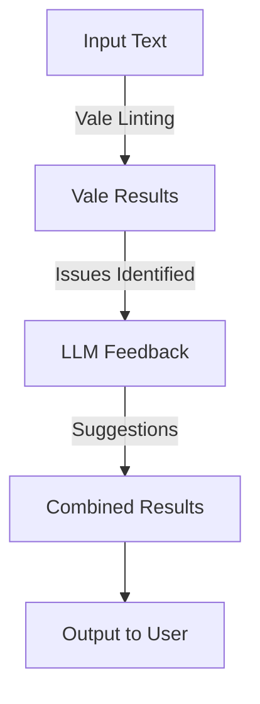

# ClinLint

ClinLint is an advanced service combining rule-based linting (**Vale**) and human-like reasoning (**LLM**) to improve Clinical Study Reports (CSRs).

---

## How It Works

### Summary

1. **Vale Linting**: Checks for rule violations based on templates (e.g., grammar, style, compliance).
2. **LLM Integration**: Uses GPT-like models to analyze Vale’s findings and generate actionable improvement suggestions.
3. **Batch Processing**: Handles multiple texts in a single request, parallelized for performance.

---

### Workflow



---

## Installation

### Requirements
- Python >= 3.12
- Docker

### Steps

1. Clone the repository:
   ```bash
   git clone https://github.com/your-repo/ClinLint.git
   cd ClinLint
   ```

2. Install dependencies:
   ```bash
   pip install -r requirements/base.txt
   pip install -r requirements/dev.txt  # For development
   ```

3. Install pre-commit hooks:
   ```bash
   pre-commit install
   ```

4. Run Docker:
   ```bash
   docker-compose up --build
   ```

---

## Usage

### Single Request
```json
POST /suggestions
{
    "text": "The patient was observed to have a significant improvement.",
    "vale_config": "config/rules/final-template.ini",
    "llm_template": "improvement_prompt"
}
```

### Batch Request
```json
POST /suggestions/batch
{
    "texts": [
        {
            "text": "The patient was observed to have a significant improvement.",
            "vale_config": "config/rules/final-template.ini",
            "llm_template": "improvement_prompt"
        }
    ]
}
```

---

## Testing

Run the tests:
```bash
pytest
```

---

## Contributing

1. Ensure pre-commit hooks are installed:
   ```bash
   pre-commit install
   ```
2. Create a feature branch:
   ```bash
   git checkout -b feature-name
   ```
3. Submit a pull request for review.

---

## CI/CD

- All merges to `main` and `develop` branches trigger the CI pipeline.
- The pipeline ensures:
  1. Code formatting (Black)
  2. Static analysis (Ruff)
  3. Linting documentation (Vale)
  4. Unit tests (pytest)
```
